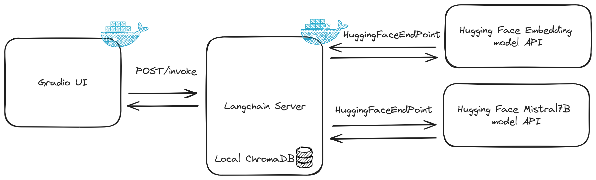

# Document retrival chabot using Mistral 7B

The following project serves as a proof of concept for a retrieval-augmented chatbot. This PoC primarily utilizes *langchain* for pipelining and incorporates open-source models from Hugging Face.

The model that are used are the following one:
- Embedding model: [Distilbert](https://huggingface.co/distilbert-base-uncased)
- LLM model: [Mistral 7B Instruct](https://huggingface.co/mistralai/Mistral-7B-Instruct-v0.1)

The principle of retrieval augmentation is to enhance the model's output by providing contextual information. In this project, I concentrated on using PDFs for Retrieval-Augmented Generation (RAG). The methodology necessitates in-memory storage for storing document embeddings, which are segmented into several parts. I chose an arbitrary division of 500 characters per embedding. This aspect could be refined by analyzing the model's performance with various hyperparameters. ChromaDB was selected for its user-friendliness and its seamless integration capabilities.

## Project architecture

The project is deployable using docker compose, as it is packaged within a single Docker container. Initially, I considered using multiple Docker containers and Langserver, but I opted to keep it simple. This decision was due to the added complexity of transmitting files through the API and the need for additional storage accessible by multiple Docker containers. The following architecture provides an overview of the project.

<p align="center">
  
</p>

## How to run the project

The project can be easily run with docker Compose, but in order to function, a `.env` file must be present alongside the `docker-compose.yml` file with a key for Hugging Face. The format of the environment variable is as follows:"
```bash
HF_API_KEY=hf_<rest of the key>
```

The following command will execute the docker-compose.yml
```
docker compose up -d
```

The UI will be available at the following address: `http://localhost:7860/`.

*The file can be passed in additional input section.*

### Limitations
The project remains a proof of concept (PoC) that offers a straightforward implementation using Langchain, but it has several limitations and areas for improvement. The primary limitation is that embeddings are computed every time a request is made. Ideally, the embeddings could be stored and reused if the file hasn't changed.

### Possible Improvement
A few potential improvements could be considered:
- Choosing a type of storage other than in-memory to enable persistence over time.
- Storing embeddings in a Q&A format could enhance the model's retrieval capabilities.
- Incorporating conversational history might be advantageous, as it allows for multiple questions to be asked about the same data. However, this would require managing conversation through the user interface.
